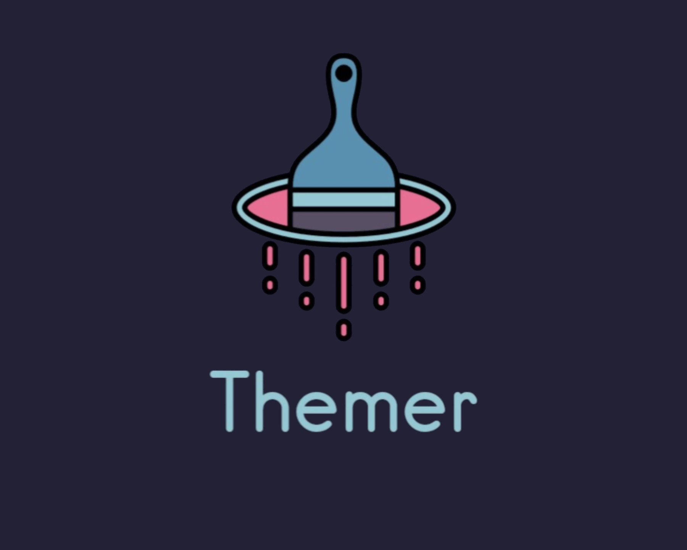

<div align="center">


<h1>THEMER - AN ORGANISED COLORSCHEME WORLD</h1>

<h5>Colorifying neovim editors since 2021</h5>

<h2> ━━━━━━  ❖  ━━━━━━ </h2>

<!-- BADGES -->
<a href="https://github.com/neovim/neovim">  </a>
<a href="https://github.com/narutoxy/themer.lua/stargazers">
    
</a>
<a href="https://github.com/narutoxy/themer.lua/network/members/">
    
</a>

<a href="https://discord.gg/X5e3z24u">
  
</a>
</div>

[Credits: Logo by Binx](#green_heart-credits)

# README WIP

# 🔧 Installation
- [Packer](https://github.com/wbthomason/packer.nvim)
```lua
use({
	"narutoxy/themer.lua",
	config = function()
		require("themer")({colorscheme = "rose_pine"})
	end,
})
```
Resource the current file, and run `:PackerInstall` to install the plugin.

- [vim-plug](https://github.com/junegunn/vim-plug)
```vim
Plug 'NarutoXY/themer.lua'
```
Resource the current file, and run `:PlugInstall` to install the plugin.

Now you can place this base configuration in your `init.vim` file:
```vim
lua << EOF
	require("themer")({colorscheme = "dark_cpt"})
EOF
```

or you can also place this in your `init.vim` file:
```vim
colorscheme dark_cpt 
```

# 🍰 Supported Plugins
- [Treesitter](https://github.com/nvim-treesitter/nvim-treesitter)
- [LSP diagnostics](https://neovim.io/doc/user/lsp.html)
- [Barbar](https://github.com/romgrk/barbar.nvim)
- [Indent-Blankline.nvim](https://github.com/lukas-reineke/indent-blankline.nvim)
- [nvim-cmp](https://github.com/hrsh7th/nvim-cmp)
- [Telescope.nvim](https://github.com/nvim-telescope/telescope.nvim)
- [Galaxyline.nvim](https://github.com/Ntbbloodbath/galaxyline.nvim)
- [BufferLine.nvim](https://github.com/akinsho/bufferline.nvim)
- [GitSigns](https://github.com/lewis6991/gitsigns.nvim)
- [Lualine.nvim](https://github.com/hoob3rt/lualine.nvim)

# 🌹 Supported colorschemes

|				   | Colorschemes     | Code Names         |
| ---------------- | ---------------- | ------------------ |
| ✅			   | Dark Catppuccino | `dark_cpt`         |
| ✅               | Rose Pine        | `rose_pine`        |
| ✅               | Rose Pine Moon        | `rose_pine_moon`        |
| ✅               | EverForest | `everforest`        |
| ✅               | Doom One        | `doom_one`        |
| ✅               | Rose Pine Dawn       | `rose_pine_dawn`        |
| ✅               | Dracula          | `dracula`          |
| ✅               | Papa Dark      | `papa_dark`          |
| ✅				| One Dark 		| `onedark`			|
| ✅				| Nord 		| `nord`			|
| ✅ | Kurai | `kurai` |


# :green_heart: Credits
Massive shoutouts to the people who supported the project! These are:
- Binx, for making that gorgeous logo for free!
    - [Github](https://github.com/Binx-Codes/)
    - [Reddit](https://www.reddit.com/u/binxatmachine)
- Papa Megamind
- Tarun Da Coder
    - [Github](https://github.com/tarundacoder/)
- Gilfoyle
    - [Github](https://github.com/tamton-aquib/)
- Max397574
    - [Github](https://github.com/max397574/)
    - [Reddit](https://www.reddit.com/u/m397574)
